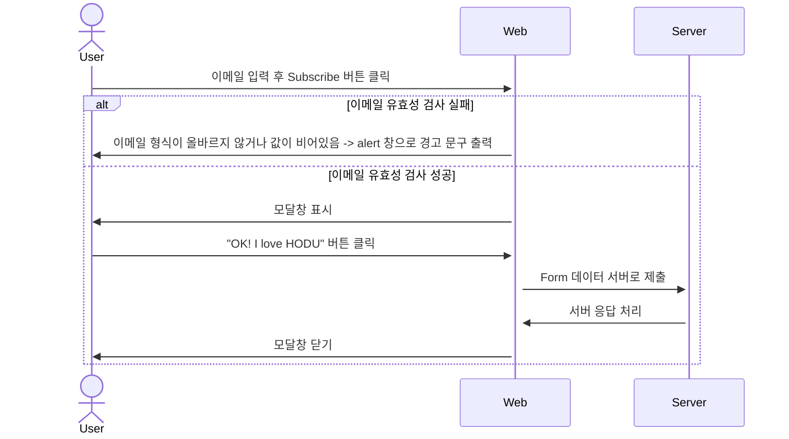
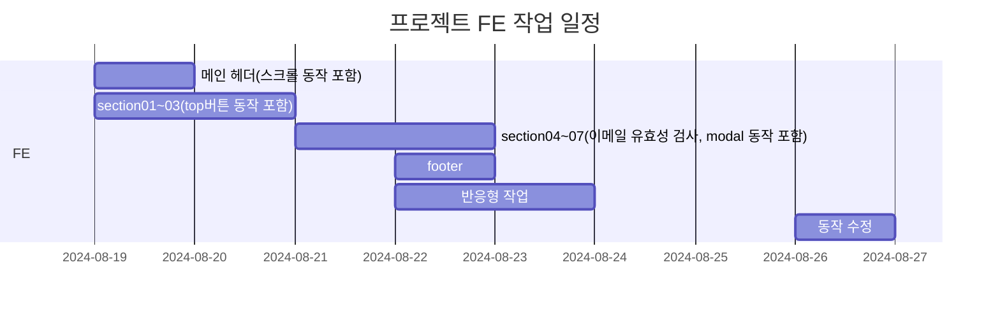
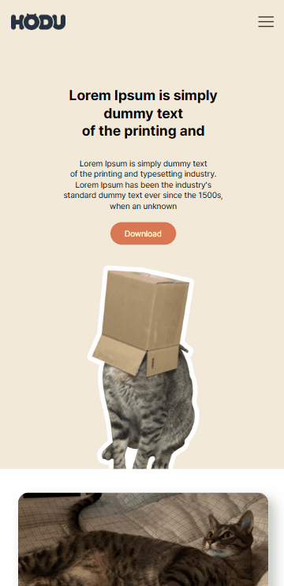
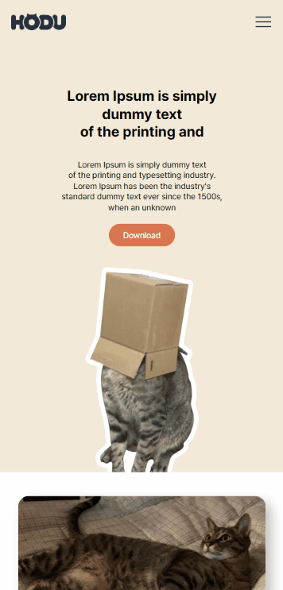
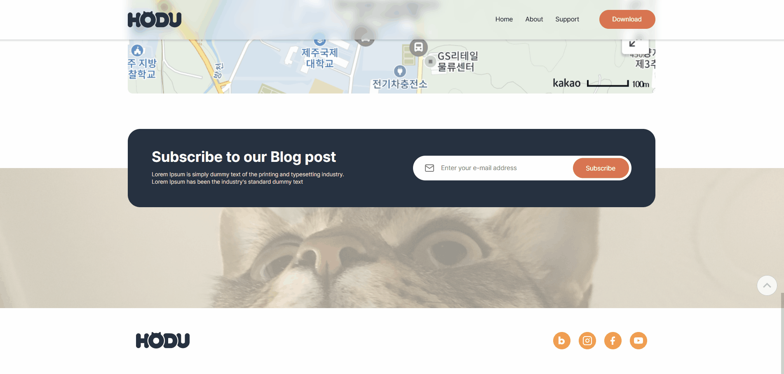
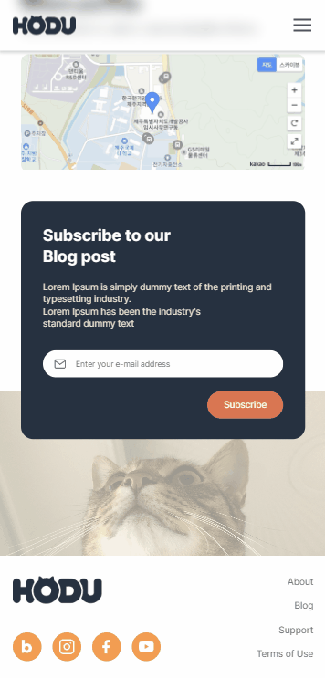

# [ESTsoft] 개인 FE-PROJECT
작업자 : 조아정(<a href="https://github.com/jeongggggg">@dejeong</a>)

---

## 1. 목표와 기능

### 1.1 목표
- 피그마 링크와 요구사항 명세를 참고하여 랜딩페이지를 제작
- 모바일 화면도 고려하여 과제를 수행

### 1.2 기능
- 구독하기 모달창 이메일 유효성 검사

---

## 2. 개발 환경 및 배포 URL
### 2.1 개발 환경
-   IDE
    - IntelliJ(2024.1.4)
- 사용 언어
    - HTML5, CSS, JavaScript
### 2.2 배포 URL
- https://jeongggggg.github.io/HODU-landing/

---
## 3. 요구사항 명세와 기능 명세
- 피그마를 참고(<a href="https://www.figma.com/design/s9RCnA6dSi3QHHeMDFHKE6/EST-오르미(BE)_HTML%2FCSS%2FJS?node-id=104924-12&t=DkHqKMa1PBxYw4n3-0">피그마 시안 링크</a>)하여 페이지 구현을 합니다.
- 모바일 화면도 고려하여 페이지 구현을 합니다.
- 스크롤시 헤더가 고정되게 합니다. (단, 처음에는 고정된 상태가 아닙니다.)
    - 스크롤 탑 버튼을 구현합니다.
    - 스크롤 탑 버튼은 스크롤시 나타납니다.
    -  스크롤 탑 버튼은 푸터 아래로 내려가지 않습니다.
    - 스크롤 탑 버튼을 누르면 스크롤이 최상단으로 올라갑니다. (단, 부드럽게 올라가야 합니다.)
- 구독하기 모달창
    - 이메일을 입력하고 `Subscribe` 버튼을 클릭하면 모달창이 나타납니다.
    - 이메일 유효성 검사를 진행해야 합니다. (값이 들어가지 않거나 이메일 형식이 유효하지 않으면 alert 창으로 경고 문구가 떠야합니다.)
    - 이메일이 잘 입력되었다면 모달창이 뜹니다. 이때 모달창의 `OK! I love HODU` 버튼을 클릭하면 form이 제출되고 모달창이 닫힙니다.

## 4. 프로젝트 구조와 개발 일정
### 4.1 프로젝트 구조

  📦HODU-landing  
  ┣ 📂css   
  ┃ ┣ 📜footer.css  
  ┃ ┣ 📜header.css  
  ┃ ┣ 📜index.css  
  ┃ ┣ 📜reset.css   
  ┣ 📂img  
  ┃ ┣ 📂icon  
  ┃ ┣ 📂mo   
  ┃ ┣ 📂popup    
  ┣ 📂js   
  ┃ ┣ 📜index.js   
  ┣ 📜 index.html

### 4.1 개발 일정(WBS)

## 5. 화면 설계

<table>
    <tbody>
        <tr>
            <td>PC</td>
            <td>MO</td>
        </tr>
        <tr>
            <td>
		        
            </td>
            <td>
                
            </td>
        </tr>
        <tr>
            <td>Top Button</td>
            <td>Mobile menu</td>
        </tr>
        <tr>
            <td>
                
            </td>
            <td>
                
            </td>
        </tr>
        <tr>
            <td>PC Subscribe</td>
            <td>MO Subscribe</td>
        </tr>
        <tr>
            <td>
                
            </td>
            <td>
                
            </td>
        </tr>
    </tbody>
</table>

## 6. 개발하며 느낀점

- 추후 사이즈가 커졌을 때, 협업을 진행하게 될 프로젝트로 여기고 진행하는 부분에서 나만 읽기 쉬운 코드보다 다른 개발자도 읽기 쉬운 코드를 만들기 위해 노력했다.   단순히 만들고 구현하고 끝나는 게 아닌, `유지보수성`과 `코드의 확장성`, `재활용성`을 생각하며 스크립트를 작성하는 부분에서 많은 고민을 하면서 진행한 것 같다.    어느 코드가 좋은 코드인지 아직은 보는 눈이 부족하지만, 더 다양한 코드를 접하고, 읽어보고, 다른 기업들의 스타일 가이드를 읽어보는 부분에서 성장하고 도움이 된다고 생각했다.